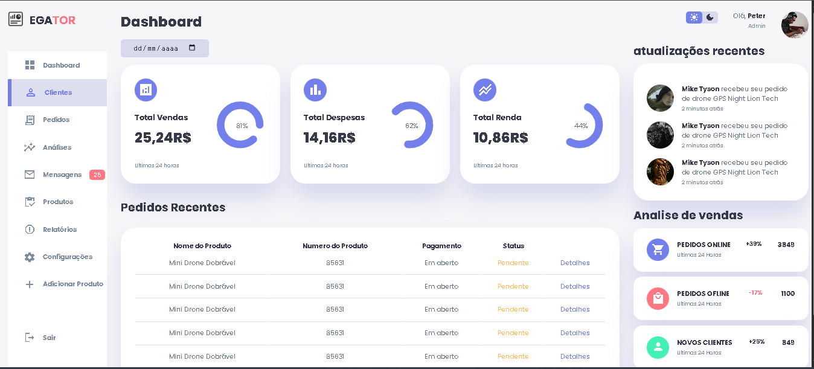
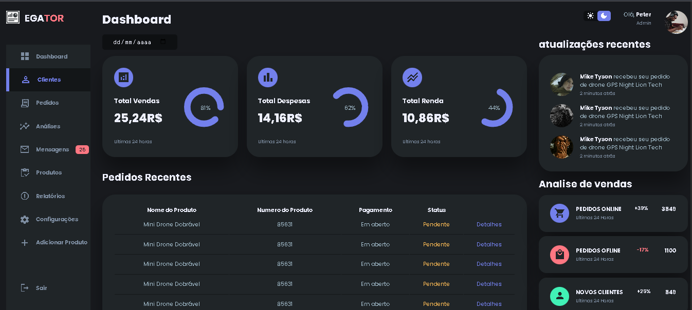
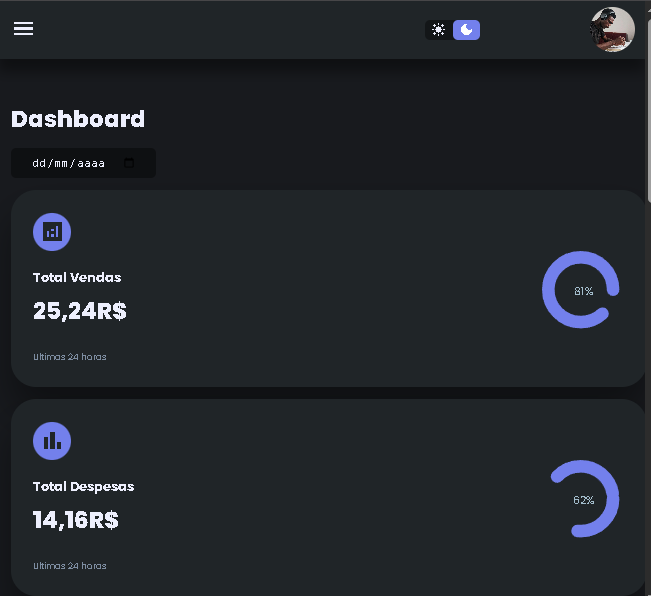

# 📊 Dashboard Administrativo

Um Dashboard Responsivo desenvolvido em HTML, CSS e JavaScript, ideal para gerenciamento de clientes, pedidos e análises de vendas.
O layout é moderno, possui modo claro/escuro e se adapta a diferentes tamanhos de tela. 

 

# 🚀 Funcionalidades

📂 Menu lateral com navegação entre seções (Clientes, Pedidos, Produtos, Relatórios, etc).

🌗 Alternância entre tema claro e escuro.

📅 Seleção de datas para visualização de informações.

📈 Cards de insights mostrando vendas, despesas e renda.

🛒 Tabela de pedidos recentes com status e detalhes.

🔔 Área de atualizações recentes com fotos de usuários.

📉 Análises de vendas (pedidos online, offline e novos clientes).

📱 Design responsivo para desktop, tablet e mobile.

 

# 🛠️ Tecnologias Utilizadas

HTML5 – estrutura do projeto.

CSS3 – estilização com variáveis, responsividade e animações.

JavaScript – interatividade (menu lateral e troca de tema).

Google Fonts & Material Icons – ícones e tipografia.

 

# 📸 Screenshots

### 🌞 Tema Claro

### 🌙 Tema Escuro

### 📱 Tema Mobile

 

# 📂 Estrutura do Projeto

/
├── index.html   # Página principal

├── style.css   # Estilos globais

├── script.js   # Lógica de interatividade

├── /img   # Imagens e perfis

│   ├── logo.png  
│   ├── profile-1.jpg  
│   ├── profile-2.jpg  
│   ├── profile-3.jpg  
│   ├── profile-4.jpg  

 

# ▶️ Como Executar

1. Clone este repositório:

git clone https://github.com/PetersonWilianMartins/Dashboard-ADM.git

2. Abra o arquivo index.html no navegador

 

# 📌 Melhorias Futuras

 Conectar com backend (API para pedidos e clientes)

 Adicionar gráficos dinâmicos (Chart.js ou Recharts)

 Implementar autenticação de usuários

 Criar versão PWA (Progressive Web App)

  

# 📄 Licença

Este projeto está sob a licença MIT – sinta-se livre para usar e modificar.
